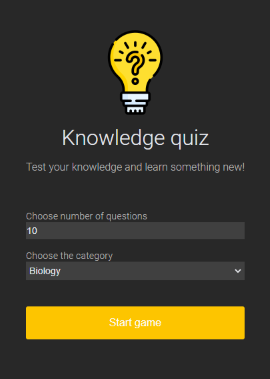
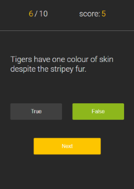
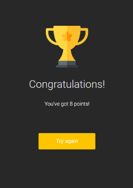

# Knowledge quiz

## About
This project is a knowlege quiz using [Trivia Database API](https://opentdb.com/api_config.php).
On the home page the user will be able to choose between five different categories. Number of questions can be also change. On the game board users will see question number they are answering and current amount of points. On the result board total score is displayed alongside with "try again" button.

  

[Live site URL]()

## Built with
- HTML
- CSS
- JavaScript
- Trivia Database API
- mobile-first worlflow